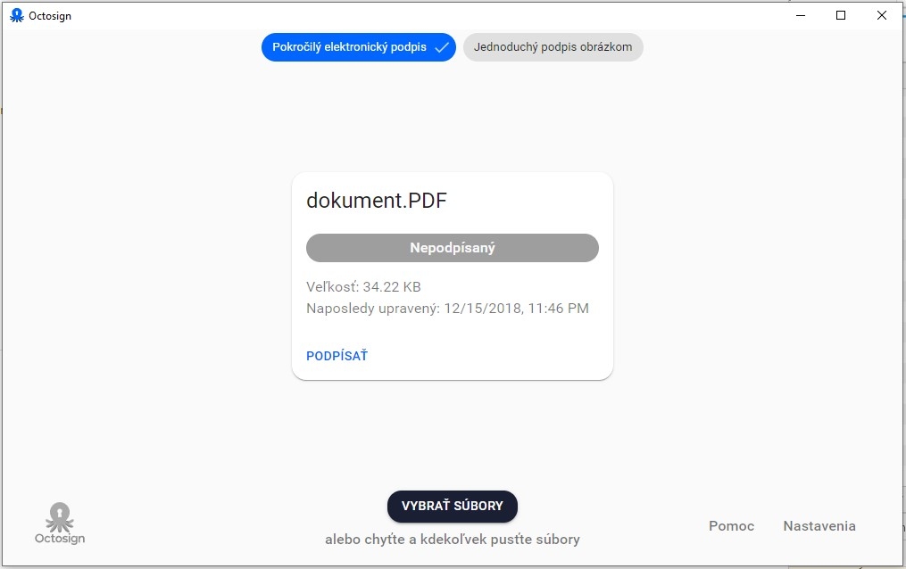
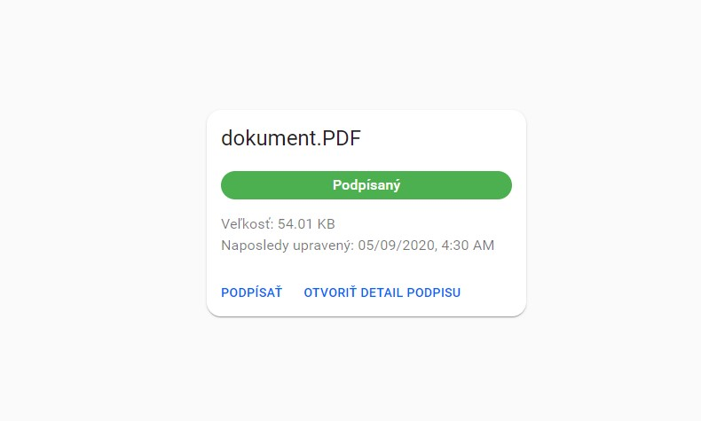
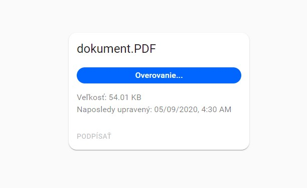
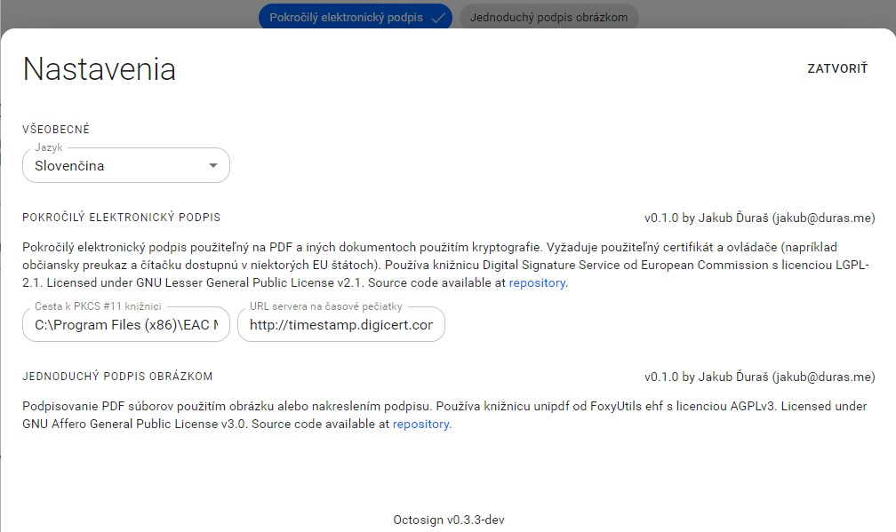

## Stiahnutie a inštalácia aplikácie

Otvorte si podstránku [Stiahnuť](/sk/download) kde si kliknutím na tlačidlo pre svoj operačný systém stiahnete aplikáciu.

Po stiahnutí otvorte súbor a nasledujte inštrukcie.

## Podpísanie dokumentu

Ako prvé je potrebné zvoliť dokument.
Pre zvolenie dokumentu je možné použiť tlačidlo "Vybrať súbory" alebo preniesť váš súbor do aplikácie.
Odporúčaný formát dokumentu je PDF, ale iné formáty sú tiež podporované.

Po zvolení dokumentu sa zobrazí karta s názvom vášho dokumentu podobne ako je možné vidieť na obrázku.

Pri podpísaní je možné zvoliť rôzne možnosti podpisu viditeľné v hornej časti obrazovky.
Predvolený spôsob je "Pokročilý elektronický podpis", ak je dostupný, inak "Jednoduchý podpis obrázkom".
Pri podpise obrázkom je na PDF dokument umiestnený len nakreslený alebo vybraný obrázok.
Pri podpise pokročilým elektronickým podpisom je možné podpísať dokument kvalifikovaným elektronickým podpisom.

Pre zahájenie podpísania stlačte tlačidlo "PODPÍSAŤ" na karte dokumentu.
Nasledujte inštrukcie a po úspešnom podpísaní bude dokument označený ako "Podpísaný".

## Overenie podpisu dokumentu

Overovanie podpisu dokumentu sa automaticky spustí po výbere dokumentu a nie je nutné ho vykonať manuálne.

Po dokončení overovania sa zobrazí na karte stav podpisu, ktorý môže byť "Podpísaný", "Nepodpísaný", "Neplatný", "Neznáme" a "Neurčité".

Ak bol rozpoznaný aspoň jeden podpis, je možné otvoriť bližšie informácie o podpise kliknutím na tlačidlo "OTVORIŤ DETAIL PODPISU".

## Nastavenia

Nastavenia je možné otvoriť kliknutím na text "Nastavenia" v pravej dolnej časti aplikácie.

Nastaviť je možné jazyk a taktiež hodnoty špecifické pre daný druh podpisu.

### Nastavenia pokročilého elektronického podpisu

Dostupné nastavenia sú:

- **Cesta k PKCS #11 knižnici** - Cesta sa automaticky predvyplní ak je na počítači detegovaná prítomnosť známeho podporovaného softvéru. Ak nie, je možné ju vyplniť manuálne cestou, ktorú získate od dodávateľa softvéru pre vaše zariadenie. Cesta musí smerovať k súboru spĺňajúcemu štandard PKCS #11 v 64 bitovej verzii.
- **URL servera na časové pečiatky** - URL je automaticky predvyplnená na hodnotu "http://timestamp.digicert.com". V prípade, že chcete nastaviť iný server, prepíšte adresu vlastnou, ale dbajte na vypísanie všetkých častí adresy vrátane protokolu ("http://" alebo "https://").
