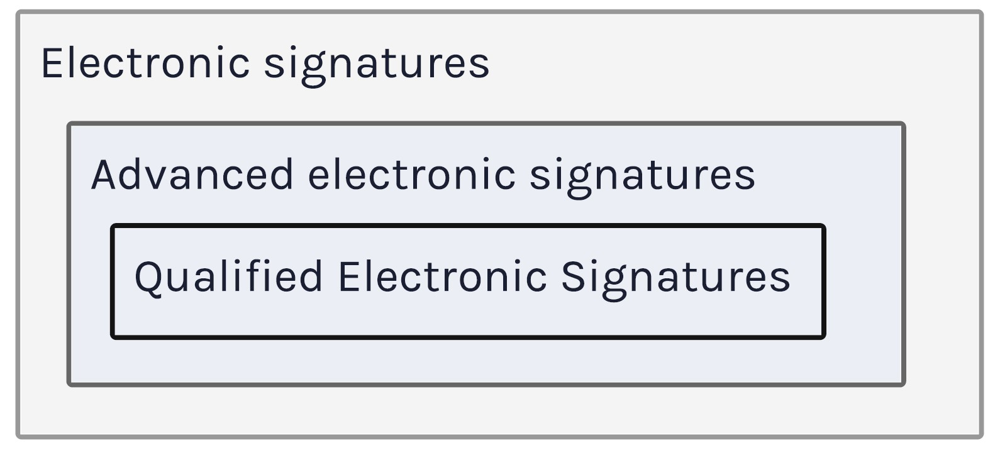

*Author of this content is not a lawyer and this content should not be considered legal advice.*

## EU regulation eIDAS

Law within the EU regarding the electronic signatures used to differ a fair bit.
This changed with the arrival of the EU regulation eIDAS (Electronic Identification, Authentication, and Trust Services).

It entered into force on the 17th of September, 2014, and regulates, among other things, electronic signatures in the European Union's internal market. It brought several standards for interoperable solutions.

## Signature qualification

One of the most important parts is the tiered approach to the electronic signature qualification.
No electronic signature can be denied in the court just based on the fact that it is in electronic form and does not follow a specific standard.

We recognize three types of electronic signatures based on their qualification.

1. **Electronic signature** - Any signature in the electronic form.
2. **Advanced electronic signature** - An electronic signature that meets several requirements: it uniquely identifies its signee, only the signee can sign using their signature, any changes made to the document after it has been signed must be detected, and it should be possible to reliably identify the signee. From the technical point of view, standards that follow those requirements are PAdES, XAdES, and CAdES.
3. **Qualified electronic signature** - An Advanced electronic signature, that is created using a qualified device and a qualified certificate using a qualified third party. Such signatures have a legal effect of a handwritten signature.

Qualified electronic signatures are, therefore, a subset of Advanced electronic signatures, which are, in turn, a subset of electronic signatures.

For more information, you can check, for example, https://go.eid.as.
